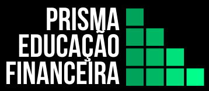

# Layout Prisma Educação Financeira

## Aceleradora de Métodos Ágeis 

## Exercício Criação de Layout

    

<h3 align="center">
  :sparkles: Olá, bem-vindes ao Layout do projeto Prisma Educação Financeira, que visa levar  :woman_technologist:
</h3>
 

### Saiba mais sobre a Prisma Educação Financeira

    
 A estrutura de um **Prisma** recebe uma iluminação e dissipa em várias outras cores. Assim como um prisma que multiplica algo, o projeto possui o objetivo de democratizar o conhecimento acerca da educação financeira, e empoderar a sociedade, para que possam disseminar o aprendizado e ajudar a instruir os outros ao seu redor sobre as melhores práticas para manejar as suas finanças. Vem com a **Prisma Educação Financeira**! Tome as rédeas da sua vida financeira, sem conflito de interesse e que pode lhe proporcionar mais rentabilidade.

